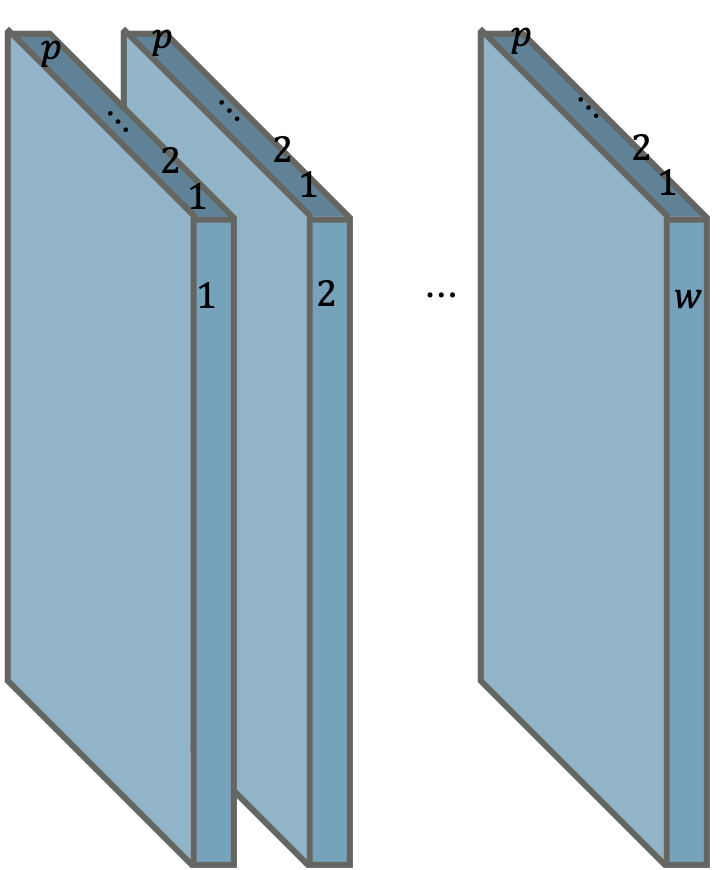

# Online SOM Detector

Anomaly detection using *Self-Organizing Maps*

## Motivation

Given multivariate time series, we are trying to outlying pattern. This represents anomaly.

1. Slide window
2. Bind the windows

Then we get 3d tensor. Now fit Self-organizing maps to this form of data-set.

Different with ordinary SOM structure, we use input **matrices**, not vectors.
