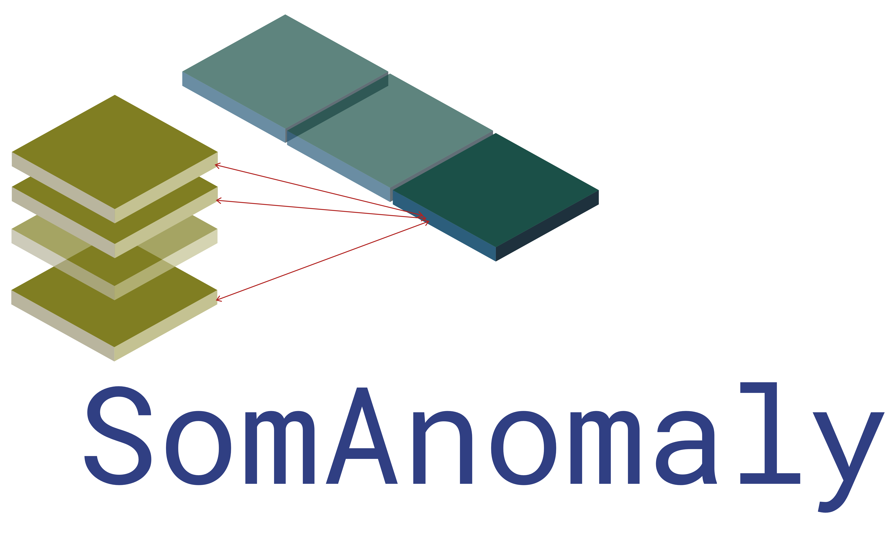
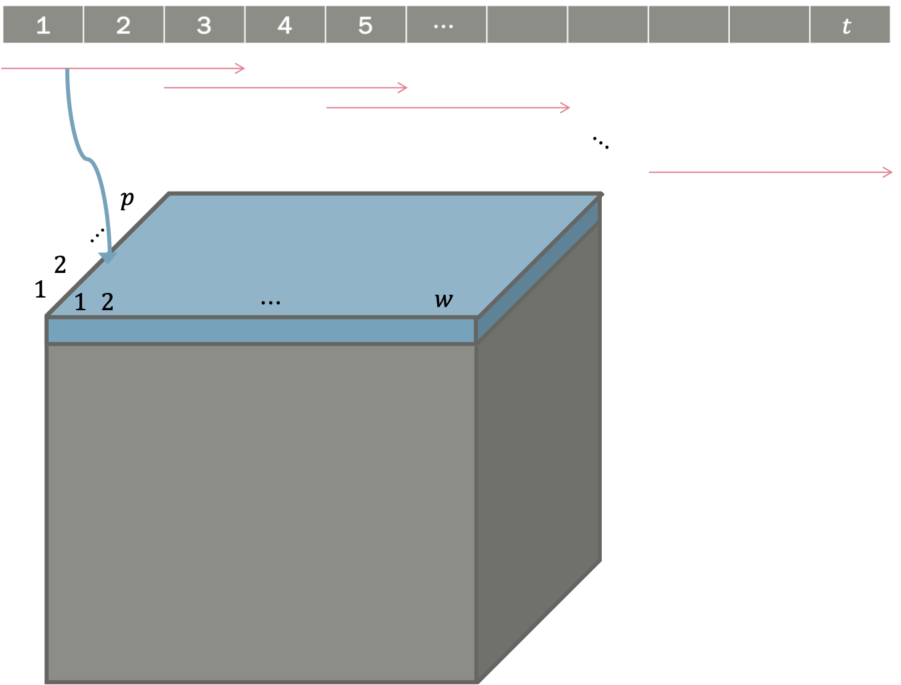
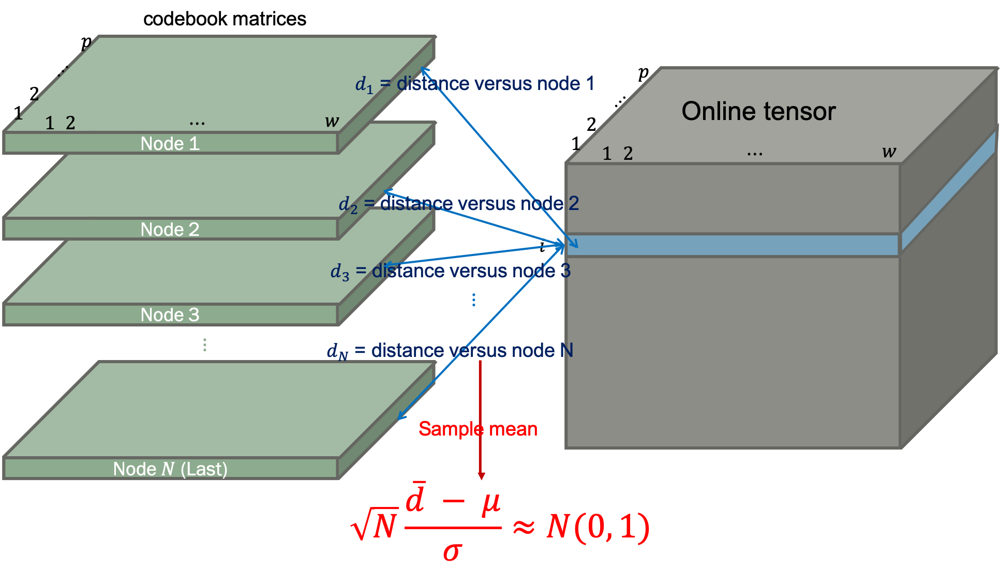

# 

<!-- badges: start -->
[](https://zenodo.org/badge/latestdoi/198335097)
<!-- badges: end -->

**SOMAD** (Self Organizing Map for Anomaly Detection) - Anomaly detection using [Self-Organizing Maps](https://en.wikipedia.org/wiki/Self-organizing_map)

This is the source code for the following conference paper:

Kim Y.G., Yun JH., Han S., Kim H.C., Woo S.S. (2021) Revitalizing Self-Organizing Map: Anomaly Detection Using Forecasting Error Patterns. In: Jøsang A., Futcher L., Hagen J. (eds) ICT Systems Security and Privacy Protection. SEC 2021. IFIP Advances in Information and Communication Technology, vol 625. Springer, Cham. [https://doi.org/10.1007/978-3-030-78120-0_25](https://link.springer.com/chapter/10.1007/978-3-030-78120-0_25)

## Building

This module requires the following.

- Numpy: [www.numpy.org](https://www.numpy.org)
- pandas: [pandas.pydata.org](https://pandas.pydata.org)
- scipy: [www.scipy.org](https://www.scipy.org)
- scikit-learn: [scikit-learn.org/stable/](https://scikit-learn.org/stable/)
- plotly: [plot.ly/python/](https://plot.ly/python/)
- matplotlib: [matplotlib.org](https://matplotlib.org)
- tqdm: [tqdm.github.io](https://tqdm.github.io)
- argparse: [github.com/ThomasWaldmann/argparse](https://github.com/ThomasWaldmann/argparse/)

```
git clone https://github.com/ygeunkim/somanomaly.git
cd somanomaly
python setup.py build
python setup.py install
```

### Usage

In command line, you can run *SOMAD* using `somanomaly/detector.py`:

```
python main.py [-h] [-c COLUMN] [-e EVAL] [--standardize] [-w WINDOW]
               [-j JUMP] [-x XGRID] [-y YGRID] [-p PROTOTYPE]
               [-n NEIGHBORHOOD] [-m METRIC] [-d DECAY] [-s SEED]
               [-i ITER] [-a ALPHA] [-r RADIUS] [--subset SUBSET]
               [-l LABEL] [-u THRESHOLD] [-b BOOTSTRAP] [-o] [--find FIND]
               [-q MULTIPLE] [-1] [-2] [-3]
               normal online output
```

The following is a description of each argument.

### Positional arguments

```
-h, --help  show the help message and exit
```

#### Input file

For now, this function reads only `*.csv` files using `pandas.read_csv()`

```
normal  Normal dataset file
online  Online dataset file
```

Warning: *this function requires exactly same form of both files.
If you use `-c` option, it will be applied to both normal data set file and online data-set file.*

In case of `-c`, follow the python `range(start, end)` function.
Then the columns from `start + 1` to `end` in the file will be read.

```
-c  Column index to read - start,end (Default = every column)
```

#### Output file

```
output  Anomaly detection output file
```

This file does not have any column header or row index. You can output multiple files using comma.

- anomaly detection
- SomAnomaly statistic
- anomaly detection for each window

If you add one more file using comma, two more files will be generated.

### Optional arguments

#### True value

```
-e, --eval  True label file
```

If this file is provided, evaluation result (precision, recall, and F1-score) will be printed.

#### SOM

```
--standardize  Standardize both data sets
```

Options for training and detection have default values, respectively.
So all these are optional arguments.

#### Training SOM

```
-w, --window  Window size (Default = 30)
-j, --jump  Shift size (Default = 30)
-x, --xgrid  Number of x-grid (Default = 50)
-y, --ygrid  Number of y-grid (Default = 50)
-p, --prototype  Topology of SOM output space - hexagonal (default) or rectangular
-n, --neighborhood  Neighborhood function - gaussian (default), triangular, or bubble
-m, --metric  Distance function - frobenius (default), nuclear, mahalanobis, or eros
-d, --decay  Decaying function - exponential (default) or linear
-s, --seed  Random seed (Default = system time)
-i, --iter  Epoch number (Default = 50)
-a, --alpha  Initial learning rate (Default = 0.1)
-r, --radius  Initial radius of BMU neighborhood (Default = 2/3 quantile of every distance between nodes)
--subset  Subset weight matrix set among epochs (Default = epoch number)
```

#### Detecting anomaly

```
-l, --label  Anomaly and normal labels, e.g. 1,0 (default)
-u, --threshold  Threshold method - cltlind (default), clt, anova, ztest, mean, quantile, radius, inv_som, kmeans, hclust
```

In case of `ztest` or `ztest_proj` of `-m`, you can specify quantile simultaneously. The default is `.9`.
If you give, for instance, `-m ztest,0.95`, you can use 0.95 chi-squared quantile.

The following are additional arguments that can adjust `clt` and `cltlind` thresholds.

```
-b, --bootstrap  Bootstrap sample numbers (Default = 1, bootstrap not performed)
-o, --overfit  Use only mapped codebook if specified
--find  When using mapped codebook, their neighboring nodes also can be used. - radius for neighbor (Default = None, only themselves)
-q, --multiple  Multiple testing method - gai (default), invest, or bh
``` 

Both `invest` and `gai` have option for the detector. See each

- *Foster, D. P., & Stine, R. A. (2008). α‐investing: a procedure for sequential control of expected false discoveries. Journal of the Royal Statistical Society Series B-Statistical Methodology, 70(2), 429–444. http://doi.org/10.1111/j.1467-9868.2007.00643.x*
- *Aharoni, E., & Rosset, S. (2014). Generalized α‐investing: definitions, optimality results and application to public databases. Journal of the Royal Statistical Society Series B-Statistical Methodology, 76(4), 771–794. http://doi.org/10.1111/rssb.12048*

`invest,number` or `gai,number` will control an *eta* in mFDR. Additionally, `gai+number` will control the upper bound of power for `gai` (Generalized alpha-investing).

#### Plot

You can see the following plots if writing each parameter.

```
-1, --eror  Plot reconstruction error for each epoch
-2, --heat  Plot heatmap of SOM
-3, --pred  Plot heatmap of projection onto normal SOM
```

***

## Motivation

### Pre-processing

<p align="center">
    
</p>

Given multivariate time series, we are trying to find outlying pattern. This represents anomaly.

1. Slide window
2. Bind the windows

Then we get 3d tensor. Now fit Self-organizing maps to this form of data-set. Different with ordinary SOM structure, we use input **matrices**, not vectors.

The algorithm requires computing *distance between matrices* - input matrix and codebook matrix.

### Anomaly detection

Using **distances from codebook matrices**, think the windows that have large distance values from the codebook matrices as anomalies.

<!---
- Average distances
- Clustering
-->

#### Central limit theorem

To know some window, i.e. an observation in the tensor is anomaly,

1. Compute every distance versus codebook matrix and average.
2. If the SomAnomaly statistic is larger than Z-quantile, the window is detected as anomaly.
3. Statistical test for each window is conducted, so we correct the significance level appropriately. 

<p align="center">
    
</p>

<!---
#### 2-means clustering

Perform 2-means clustering for codebook matrices and online data-set.

1. Set codebook matrices by group 0. This group indicates normal and does not change.
2. Randomly assign group 0 or 1 for online data-set.
3. Iterate until cluster converges:
    1. For each cluster, compute centroid.
    2. Compute distance between centroid and every online matrix.
    3. Assign each online observation matrix to the group with smaller distance.
-->
