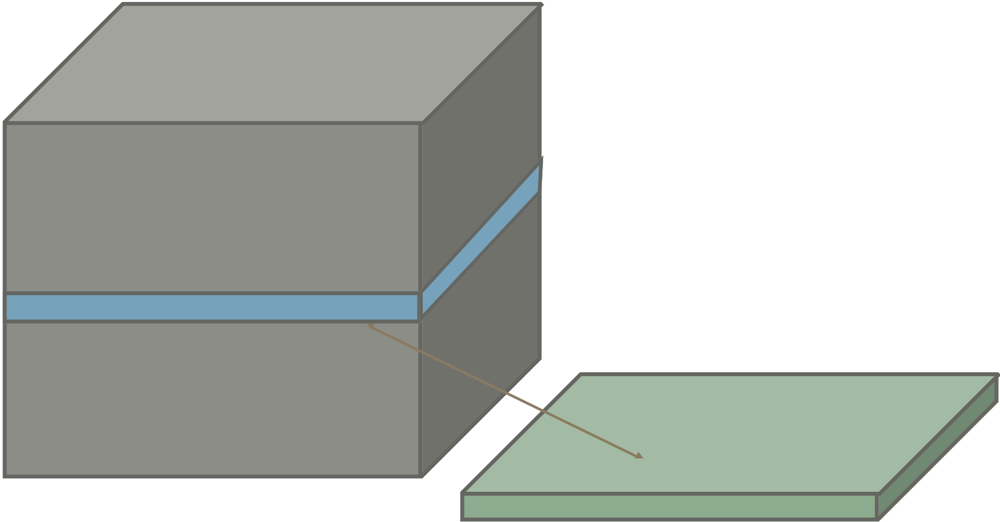
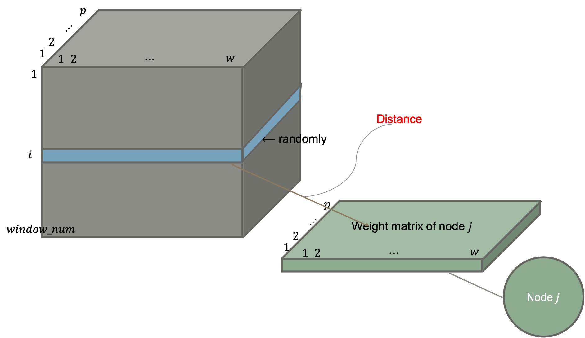
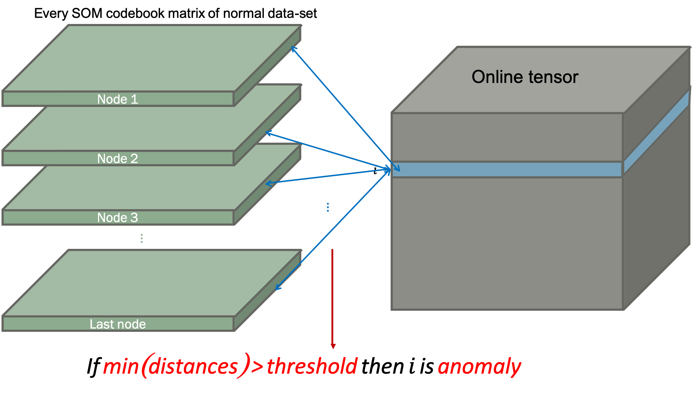
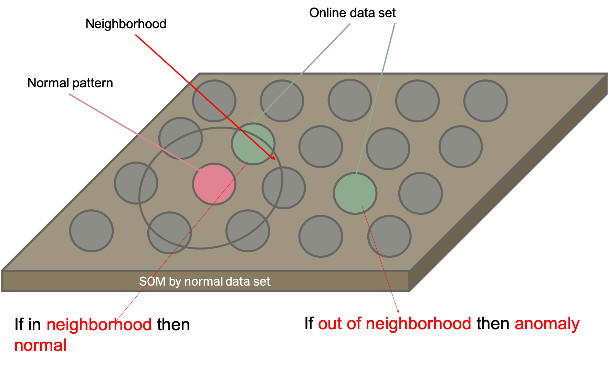

# 

**Online SOM Detector** - Anomaly detection using Self-Organizing Maps

## Building

```
git clone https://github.com/ygeunkim/somanomaly.git
cd somanomaly
python setup.py build
python setup.py install
```

### Usage

In terminal, you can run *Online SOM detector* using `somanomaly/detector.py`:

```
cd somanomaly
python detector.py -n <normal_file> -o <online_file> {-c} <column_range> -p <output_file>
                        {-w} <window_size> {-j} <jump_size> {-x} <x_grid> {-y} <y_grid> 
                        {-t} <topology> {-f} <neighborhood> {-d} <distance> {-s} <seed>  
                        {-e} <epoch> {-a} <init_rate> {-r} <init_radius>
                        {-l} <label> {-m} <threshold>
                        {-1} {-2} {-3}
```

The following is a description of each argument.

```
-h, --help  show the help message
```

### File path

#### Input file

For now, this function reads only `*.csv` files using `pandas.read_csv()`

```
-n  Normal dataset file
-o  Online dataset file
-c  Column index to read - start,end (Default = every column)
```

Warning: *this function requires exactly same form of both files.
If you use `-c` option, it will be applied to both normal data set file and online data-set file.*

In case of `-c`, follow the python `range(start, end)` function.
Then the columns from `start + 1` to `end` in the file will be read.

#### Output file

```
-p  Anomaly detection output file
```

This file does not have any column header or row index.

### SOM

Options for training and detection have default values, respectively.
So all these are optional arguments.

#### Training SOM

```
-w  Window size (Default = 60)
-j  Shift size (Default = 60)
-x  Number of x-grid (Default = 20)
-y  Number of y-grid (Default = 20)
-t  Topology of SOM output space - rectangular (default) or hexagonal
-f  Neighborhood function - gaussian (default) or bubble
-d  Distance function - frobenius (default) or nuclear
-s  Random seed (Default = system time)
-e  Epoch number (Default = 100)
-a  Initial learning rate (Default = 0.05)
-r  Initial radius of BMU neighborhood (Default = 2/3 quantile of every distance between nodes)
```

#### Detecting anomaly

```
-l  Anomaly and normal labels, e.g. 1,0 (default)
-m  Threshold method - mean (default), 0.75 quantile, or radius
```

#### Plot

You can see the following plots if writing each parameter.

```
-1  Plot reconstruction error for each epoch
-2  Plot heatmap of SOM
-3  Plot heatmap of projection onto normal SOM
```

***

## Motivation

### Pre-processing

<p align="center">
    
</p>

Given multivariate time series, we are trying to find outlying pattern. This represents anomaly.

1. Slide window
2. Bind the windows

Then we get 3d tensor. Now fit Self-organizing maps to this form of data-set. Different with ordinary SOM structure, we use input **matrices**, not vectors.

The algorithm requires computing *distance between matrices* - input matrix and weight (codebook) matrix.

<p align="center">
    
</p>

### Anomaly detection

#### Threshold by distances with codebook

1. Build 3d array for online data-set.
2. Compute each distance between weight (codebook) matrix.
3. If the minimum is larger than threshold, the window is detected as anomaly.

<p align="center">
    
</p>

#### Threshold by distances between nodes

1. Project online data-set onto normal SOM.
2. Compute distance between projection and normal projection.
3. If the online projection is *not in the neighborhood of normal projection*, the window is detected as anomaly.

<p align="center">
    
</p>
