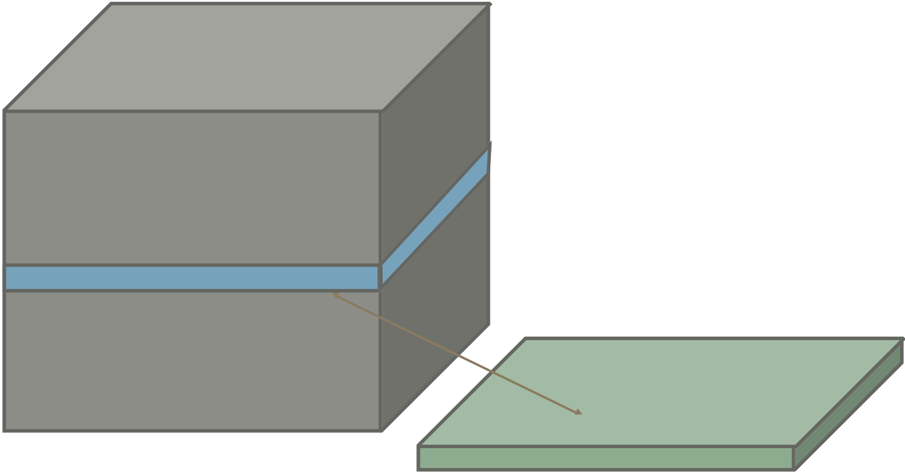
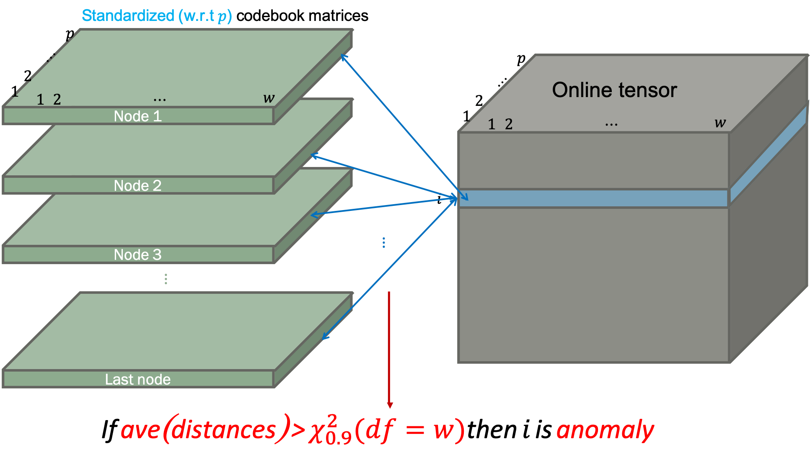

# 

**Online SOM Detector** - Anomaly detection using [Self-Organizing Maps](https://en.wikipedia.org/wiki/Self-organizing_map)

## Building

This module requires the following.

- Numpy: [https://www.numpy.org](https://www.numpy.org)
- pandas: [https://pandas.pydata.org](https://pandas.pydata.org)
- scipy: [https://www.scipy.org](https://www.scipy.org)
- scikit-learn: [https://scikit-learn.org/stable/](https://scikit-learn.org/stable/)
- plotly: [https://plot.ly/python/](https://plot.ly/python/)
- matplotlib: [https://matplotlib.org](https://matplotlib.org)
- tqdm: [https://tqdm.github.io](https://tqdm.github.io)

```
git clone https://github.com/ygeunkim/somanomaly.git
cd somanomaly
python setup.py build
python setup.py install
```

### Usage

In command line, you can run *Online SOM detector* using `somanomaly/detector.py`:

```
cd somanomaly
python detector.py -n <normal_file> -o <online_file> {-c} <column_range>
                        -p <output_file> {-z} <true_file>
                        {-i} {-w} <window_size> {-j} <jump_size> {-x} <x_grid> {-y} <y_grid> 
                        {-t} <topology> {-f} <neighborhood> {-d} <distance> {-g} <decay>
                        {-s} <seed> {-e} <epoch> {-a} <init_rate> {-r} <init_radius>
                        {-l} <label> {-m} <threshold>
                        {-1} {-2} {-3}
```

The following is a description of each argument.

```
-h, --help  show the help message
```

### File path

#### Input file

For now, this function reads only `*.csv` files using `pandas.read_csv()`

```
-n  Normal dataset file
-o  Online dataset file
-c  Column index to read - start,end (Default = every column)
```

Warning: *this function requires exactly same form of both files.
If you use `-c` option, it will be applied to both normal data set file and online data-set file.*

In case of `-c`, follow the python `range(start, end)` function.
Then the columns from `start + 1` to `end` in the file will be read.

#### Output file

```
-p  Anomaly detection output file
```

This file does not have any column header or row index.

#### True value

```
-z  True label file
```

If this file is provided, evaluation result (precision, recall, and F1-score) will be printed.

### SOM

```
-i  Standardize both data sets if specified
```

Options for training and detection have default values, respectively.
So all these are optional arguments.

#### Training SOM

```
-w  Window size (Default = 30)
-j  Shift size (Default = 30)
-x  Number of x-grid (Default = 50)
-y  Number of y-grid (Default = 50)
-t  Topology of SOM output space - hexagonal (default) or rectangular
-f  Neighborhood function - gaussian (default) or bubble
-d  Distance function - frobenius (default), nuclear, mahalanobis, or eros
-g  Decaying function - exponential (default) or linear
-s  Random seed (Default = system time)
-e  Epoch number (Default = 50)
-a  Initial learning rate (Default = 0.5)
-r  Initial radius of BMU neighborhood (Default = 2/3 quantile of every distance between nodes)
-k  Subset weight matrix set among epochs (Default = epoch number)
```

#### Detecting anomaly

```
-l  Anomaly and normal labels, e.g. 1,0 (default)
-m  Threshold method - ztest (default), ztest_proj, mean, quantile, radius, inv_som, kmeans, hclust, unitkmeans
```

In case of `ztest` or `ztest_proj` of `-m`, you can specify quantile simultaneously. The default is `.9`.
If you give, for instance, `-m ztest,0.95`, you can use 0.95 chi-squared quantile. 

#### Plot

You can see the following plots if writing each parameter.

```
-1  Plot reconstruction error for each epoch
-2  Plot heatmap of SOM
-3  Plot heatmap of projection onto normal SOM
```

***

## Motivation

### Pre-processing

<p align="center">
    
</p>

Given multivariate time series, we are trying to find outlying pattern. This represents anomaly.

1. Slide window
2. Bind the windows

Then we get 3d tensor. Now fit Self-organizing maps to this form of data-set. Different with ordinary SOM structure, we use input **matrices**, not vectors.

The algorithm requires computing *distance between matrices* - input matrix and weight (codebook) matrix.

<p align="center">
    
</p>

### Anomaly detection

Using **distances from codebook matrices**, think the windows that have large distance values from the codebook matrices as anomalies.

- Average distances
- Clustering

#### Threshold by statistical distribution quantiles

1. Standardize every weight (codebook) matrix w.r.t. variable.
2. Compute each distance between codebook matrix.
3. If the average is larger than .90 chi-squared quantile, the window is detected as anomaly.

<p align="center">
    
</p>

#### Central limit theorem

To know some window, i.e. an observation in the tensor is anomaly,

1. Compute every distance versus codebook matrix and average.
2. If the SomAnomaly statistic is larger than .90 Z-quantile, the window is detected as anomaly. 

<p align="center">
    
</p>

#### 2-means clustering

Perform 2-means clustering for codebook matrices and online data-set.

1. Set codebook matrices by group 0. This group indicates normal and does not change.
2. Randomly assign group 0 or 1 for online data-set.
3. Iterate until cluster converges:
    1. For each cluster, compute centroid.
    2. Compute distance between centroid and every online matrix.
    3. Assign each online observation matrix to the group with smaller distance.

#### Divisive hierarchical clustering

Perform divisive hierarchical clustering for codebook matrices and online data-set.
Treat codebook matrices as one group at the beginning, and use average linkage.
